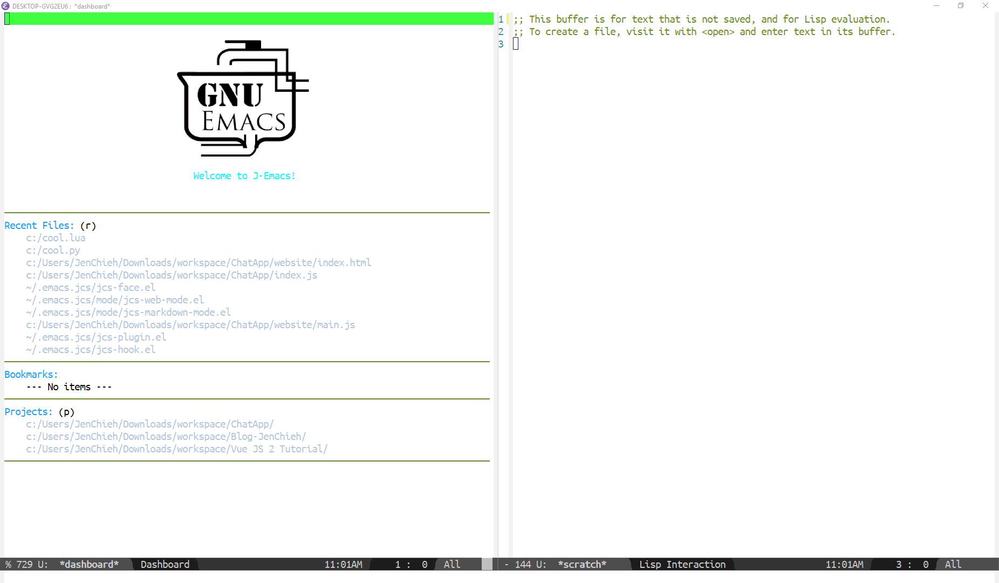
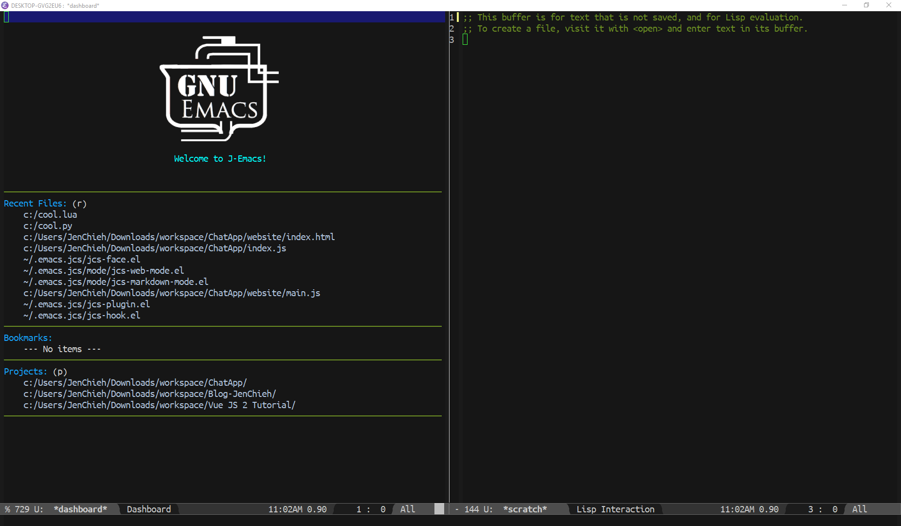

[](https://travis-ci.com/jcs090218/jcs-emacs-init)
[](https://opensource.org/licenses/BSD-2-Clause)


# jcs-emacs-init
> An Emacs configuration bundle.

This is Jen-Chieh Shen's emacs configuration. Repeatedly utilized 
and modified since 2015. Hopefully this will help someone who is 
new or struggling with Emacs. This configuration should works on 
most OSs, indicates Windows, Linux and MacOS.

Emacs itself supports multiple programming languages. I managed 
all the programming languages I personally used. I dabble in 
numerous technologies, incorporate hardware, firmware and software. 
Here is the list of programming languages I know and are extended 
from this configuration.

* ActionScript 2.0 or 3.0 / Assembly Language
* BASIC / Batchfile
* C / C++ / C# / Clojure / CMake / COBOL / CSS
* Dart
* Elixir / Emacs Lisp / Erlang
* GLSL / Go
* Haskell / Haxe / HTML
* INI
* JSON / Java / JavaScript
* Lisp / Lua
* Makefile
* Object Pascal (Delphi) / Objective-C
* Pascal / Perl / PHP / Properties / Python
* Ruby / Rust
* Sass / Scala / SCSS / Shell script / SQL / Swift
* TypeScript
* Verilog / Vim script
* XML
* YAML

This configuration polished and goes toward to the modern 
text editor, or even better, it goes beyond modern IDE. 
e.g. [Atom](https://atom.io/), [Brackets](http://brackets.io/), 
[Sublime Text 2](https://www.sublimetext.com/2) or [3](https://www.sublimetext.com/), 
[Visual Studio Code](https://code.visualstudio.com/), etc. 


## Philosophy

I have experienced many different kinds of IDEs and text 
editors. But I’ve had a hard time finding the best tool 
to use. I’ve jumped from one working field to another 
trying to find something that suits my needs. So instead 
of struggling with the tool itself, I chose Emacs and 
configured the entire thing from scratch, to suit my 
needs. Here are a few goals that I want this config 
to accomplished.

Here are a few goals that I want this config to 
accomplished.

* Having the same set of key bindings across different 
IDEs and text editors as many as possible.
* Having the same font and theme across different OSs and 
environments.
* Automating trivial or redundant tasks.
* Improve user experiences approach to modern text editor 
or IDE.
* Make compatible to most features work inside terminal 
as well.

Having these implementations makes my life easier, and 
having a genuinely portable workspace, which is great 
because it lets me work on different machine efficiently, 
without having to get used to an new IDE.


## Startup Time

The average startup time for this configuration is around 
`15` to `25` seconds. You can use command `emacs-init-time` 
to check the startup time on your machine. Not quite sure what 
causes that much of performance, hopefully, I'm able to lower 
the startup time down to `5` to `15` seconds.

**Edit:** After version `5.3.2`, the average startup time is 
around `5` to `15` seconds. Solved this issue by removing 
unnecessary `require` keyword load file and use `:defer` keyword 
with `use-package` package to delay some packages load time.

*P.S. Here is a great article about 
[Speeding Up Emacs](https://anuragpeshne.github.io/essays/emacsSpeed.html)
 written by 
[Anurag Peshne](https://github.com/anuragpeshne).*


## Features

* [*Auto Install Package*](https://github.com/jcs090218/jcs-emacs-init/blob/master/features/auto-install-package) - 
Automatically installs the package that this config relies on.
* [*Auto Truncate Lines*](https://github.com/jcs090218/jcs-emacs-init/blob/master/features/auto-truncate-lines) - 
Automatically enable/disable `truncate-lines-mode` depends 
on certain situation. (`web-mode` only)
* [*Build Run*](https://github.com/jcs090218/jcs-emacs-init/blob/master/features/build-run) - 
Implementation for executing script for building and running 
the software.
* [*Capital Word*](https://github.com/jcs090218/jcs-emacs-init/blob/master/features/capital-word) - 
You can navigate/kill word by seeing capital letter.
* [*Consistent Key Bindings*](https://github.com/jcs090218/jcs-emacs-init/blob/master/features/consistent-key-bindings) - 
Has consistent key bindings across all modes.
* [*Curly Bracket Modes*](https://github.com/jcs090218/jcs-emacs-init/blob/master/features/curly-bracket-modes) - 
Use curly bracket depends on different mode.
* [*Docstring Completion*](https://github.com/jcs090218/jcs-emacs-init/blob/master/features/docstring-completion) - 
Some standard docstring completion implementations built-in 
to this configuration.
* [*Fast Incremental Search*](https://github.com/jcs090218/jcs-emacs-init/blob/master/features/fast-incremental-search) - 
Fast keys for incremental search forward/backward 
to the cursor is currently pointing.
* [*Indent Move*](https://github.com/jcs090218/jcs-emacs-init/blob/master/features/indent-move) - 
Automatically indent when cursor moves up and down.
* [*Line Numbers Modding*](https://github.com/jcs090218/jcs-emacs-init/blob/master/features/line-numbers-modding) - 
Mixed used of `linum` and `display-line-numbers-mode` 
base on the file usage.
* [*Mini State*](https://github.com/jcs090218/jcs-emacs-init/blob/master/features/mini-state) - 
Mini mode state use to visually see what backend is the 
config currently running.
* [*Mode Line Toggle*](https://github.com/jcs090218/jcs-emacs-init/blob/master/features/mode-line-toggle) - 
Toggle to `show` or `hide` the mode line.
* [*Modern Text Editor*](https://github.com/jcs090218/jcs-emacs-init/blob/master/features/modern-text-editor) - 
Design to have the preset settings close to modern text 
editors but faster.
* [*Navigate Blank Line*](https://github.com/jcs090218/jcs-emacs-init/blob/master/features/navigate-blank-line) - 
Use `C-<up>` and `C-<down>` to navigate previous and next 
blank line.
* [*Navigate Table*](https://github.com/jcs090218/jcs-emacs-init/tree/master/features/navigate-table) - 
Navigate `org-mode`'s table easier by using arrow keys.
* [*Simulate Shell*](https://github.com/jcs090218/jcs-emacs-init/tree/master/features/simulate-shell) - 
Completely simulate shell behaviors, make better user 
experience when using shell in Emacs.
* [*Switch Window*](https://github.com/jcs090218/jcs-emacs-init/blob/master/features/switch-window) - 
Fast keys switch between windows quickly.
* [*Tabify/Untabify Modes*](https://github.com/jcs090218/jcs-emacs-init/blob/master/features/tabify-untabify-modes) -
Tabify or Untabify the file depends on the mode you 
currently in.
* [*Trim Trailing Whitespace*](https://github.com/jcs090218/jcs-emacs-init/blob/master/features/trim-trailing-whitespace) - 
Remove trailing spaces and tabs automatically on save.
* [*Visualize Undo/Redo*](https://github.com/jcs090218/jcs-emacs-init/blob/master/features/visualize-undo-redo) - 
Improved the user experience on undoing and redoing by 
showing the `undo-tree-visualizer` at the other window.
* [*VS Curly Bracket*](https://github.com/jcs090218/jcs-emacs-init/blob/master/features/vs-curly-bracket) - 
Visual Studio IDE like curly bracket implementation.
* [*VS Multiple Cursors*](https://github.com/jcs090218/jcs-emacs-init/blob/master/features/vs-multiple-cursors) - 
VSCode like methods to `mark` and `unmark` multiple cursor.


## Powered by

* *Abbreivation Definition* - powered by 
[project-abbrev](https://github.com/elpa-host/project-abbrev).
* *Auto Completion* - powered by 
[company](https://github.com/company-mode/company-mode).
* *Auto Highlight Symbol* - powered by 
[auto-highlight-symbol-mode](https://github.com/mhayashi1120/auto-highlight-symbol-mode).
* *Banner* - powered by 
[dashboard](https://github.com/emacs-dashboard/emacs-dashboard).
* *Binary/Hex Editor* - powered by 
[nhexl-mode](https://github.com/emacsmirror/nhexl-mode).
* *Collaborative Editing* - powered by 
[togetherly](https://github.com/zk-phi/togetherly) and 
[floobits](https://github.com/Floobits/floobits-emacs).
* *Context Menu* - powered by 
[right-click-context](https://github.com/zonuexe/right-click-context).
* *Docstring* - none, built-in to this configuration.
* *End of Line* - powered by 
[show-eol](https://github.com/jcs090218/show-eol).
* *Execute Commands* - powered by 
[compile](https://www.emacswiki.org/emacs/CompilationMode).
* *File Explorer* - powered by 
[sr-speedbar](http://cedet.sourceforge.net/speedbar.shtml).
* *File Header* - powered by 
[file-header](https://github.com/alt-elpa/file-header).
* *Folding* - powered by 
[origami](https://github.com/gregsexton/origami.el).
* *Font* - powered by 
[use-ttf](https://github.com/elpa-host/use-ttf).
* *Goto Char* - powered by 
[goto-char-preview](https://github.com/elpa-host/goto-char-preview).
* *Goto Line* - powered by 
[goto-line-preview](https://github.com/elpa-host/goto-line-preview).
* *Highlight Matched Pairs* - powered by 
[show-paren-mode](https://www.emacswiki.org/emacs/ShowParenMode).
* *Recet Files* - powered by 
[recentf](https://www.emacswiki.org/emacs/RecentFiles).
* *Regexp* - powered by 
[re-builder](https://www.emacswiki.org/emacs/ReBuilder).
* *Line Annotation* - powered by 
[line-reminder](https://github.com/elpa-host/line-reminder).
* *Line Numbers* - powered by 
[display-line-numbers](https://github.com/emacs-mirror/emacs/blob/master/lisp/display-line-numbers.el)
and 
[linum](https://github.com/emacs-mirror/emacs/blob/master/lisp/linum.el).
* *Minimap* - powered by 
[sublimity](https://github.com/zk-phi/sublimity).
* *Mode Line* - powered by 
[powerline](https://github.com/milkypostman/powerline).
* *Multiple Cursor* - powered by 
[iedit](https://github.com/victorhge/iedit)
and 
[multiple-cursors](https://github.com/magnars/multiple-cursors.el).
* *Navigation/Searcher* - powered by 
[ag](https://github.com/Wilfred/ag.el)
and 
[isearch-project](https://github.com/elpa-host/isearch-project).
* *Package Archive* - powered by 
[gnu](https://elpa.gnu.org/) 
and 
[melpa](http://melpa.org/),
* *Package Management* - powered by 
[use-package](https://github.com/jwiegley/use-package).
* *PDF Viewer* - powered by 
[pdf-tools](https://github.com/politza/pdf-tools).
* *Project Search* - powered by 
[projectile](https://github.com/bbatsov/projectile).
* *Reload Emacs* - powered by 
[reload-emacs](https://github.com/alt-elpa/reload-emacs).
* *Restart Emacs* - powered by 
[restart-emacs](https://github.com/iqbalansari/restart-emacs).
* *Shell* - powered by 
[shell](https://www.emacswiki.org/emacs/ShellMode) and 
[exec-path-from-shell](https://github.com/purcell/exec-path-from-shell).
* *Simplify Usage* - powered by 
[helm](https://github.com/emacs-helm/helm).
* *Smooth Scrolling* - powered by 
[sublimity](https://github.com/zk-phi/sublimity).
* *Snippet* - powered by 
[yasnippet](https://github.com/joaotavora/yasnippet).
* *Source Control Management* - powered by 
[magit](https://github.com/magit/magit).
* *Startup Screen* - powered by 
[dashboard](https://github.com/emacs-dashboard/emacs-dashboard).
* *Syntax Check* - powered by 
[flycheck](http://www.flycheck.org/en/latest/).
* *Tab Bar* - powered by 
[tabber](https://github.com/dholm/tabbar).
* *Tags* - powered by 
[gtags](https://www.gnu.org/software/global/).
* *Text Editing* - powered by 
[org-mode](https://orgmode.org/).
* *Theme* - none, self customized but close to 
[Visual Studio IDE](https://visualstudio.microsoft.com/)'s 
dark theme.
* *Todo* - powered by 
[hl-todo](https://github.com/tarsius/hl-todo).
* *Undo/Redo* - powered by 
[undo-tree](https://www.emacswiki.org/emacs/UndoTree).
* *White Space* - powered by 
[whitespace](https://www.emacswiki.org/emacs/WhiteSpace).


## Key Bindings

This configuration have all modes bind to the same set of 
key bindings. It benefits the developer would not need to change 
their key bindings while after the mode swichted. The key bindings 
set can be check in `./.emacs.jcs/jcs-key.el` file. 

P.S. 
* My work requires me to use 
[Visual Studio IDE](https://visualstudio.microsoft.com/) 
that being said the key bindings set are most likely compatible 
to 
[Visual Studio IDE](https://visualstudio.microsoft.com/). 
* Excepts keys that bind to `C-x` and `C-c`, Emacs are deeply binds 
to these two keys, and many packages also use these two keys 
for there preset keys. As you may know these two keys are often 
`cut` and `copy`, is awkward that I solved this by adding the 
same key stroke once again, hence the `cut` key is `C-x C-x` and 
the `copy` key is `C-c C-c`. 


## Themes

The theme was to design close to 
[Visual Studio IDE](https://visualstudio.microsoft.com/) 
preset light/dark theme. I believed 
[Microsoft](https://www.microsoft.com/zh-tw/) 
has a great UI/UX team, since I don't have any experience 
or work related to UI/UX, I would just like to have the 
theme color as close to it as possible. Anyway, if you 
want to customize the theme yourself, then check out the 
`./.emacs.jcs/jcs-theme.el` file. All the theme related 
variables can be found in that file.

| Light Theme                               | Dark Theme                               |
|:------------------------------------------|:-----------------------------------------|
|||


## Font

Font uses `use-ttf` package to keep cross OS consistency. 
The default font is `Ubuntu Mono` and loaded by using 
`UbuntuMono-R.ttf` located under `./.emacs.jcs/fonts/` 
folder. If you don't like the this font, you can add your 
own `.ttf` file and add the path to 
`use-ttf-default-ttf-fonts` list. Lastly, set the name 
of the `.ttf` file to `use-ttf-default-ttf-font-name`
variable.

P.S.
* See the file `./.emacs.jcs/jcs-font.el` to see how the 
font is been set in this config.
* For more details about the font settings in this 
configuration, check out the `use-ttf`package 
[repo](https://github.com/elpa-host/use-ttf).


## Installation

To install, clone this repo and copy the core `files`/`directories` 
to the emacs config directory accordingly. Make sure you backup 
your own configuration before you installed.
```bash
# clone this repo
$ git clone https://github.com/jcs090218/jcs-emacs-init.git

# change current directory to project directory
$ cd jcs-emacs-init

# copy init file to home
$ cp ./.emacs ~/

# copy core directories to home
$ cp -r ./.emacs.d ~/
$ cp -r ./.emacs.jcs ~/
```


## Supported Emacs versions

The config should run on Emacs 24.3 or higher, but I will 
recommend to always run on the latest Emacs version available 
on your machine. The ultimate goal is to design to have each 
version of config can run on their each according Emacs version 
base on the version what I'm currently running on my present 
machine. For each version record, you can check the 
[version_record](https://github.com/jcs090218/jcs-emacs-init/blob/master/emacs_version_record.txt)
file at the root of the project directory.
