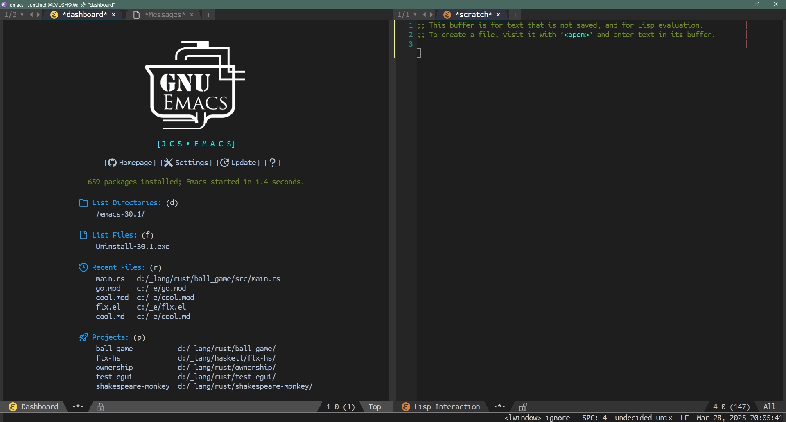

<p align="center">


</p>

<p align="center">
<a href="https://opensource.org/licenses/BSD-2-Clause"></a>
<a href="https://www.gnu.org/software/emacs/download.html"></a>
<a href="https://github.com/jcs-emacs/jcs-emacs/releases/latest"></a>
<a href="#"></a>
</p>

<p align="center">
<a href="#"></a>
<a href="#"></a>
<a href="#"></a>
</p>

<!-- markdown-toc start - Don't edit this section. Run M-x markdown-toc-refresh-toc -->
**Table of Contents**

- [jcs-emacs](#jcs-emacs)
    - [📚 Philosophy](#📚-philosophy)
    - [📰 News](#📰-news)
    - [💾 Installation](#💾-installation)
    - [🕒 Startup Time](#🕒-startup-time)
    - [🏆 Features](#🏆-features)
        - [Highlight](#highlight)
        - [Details](#details)
    - [📁 Package Archives](#📁-package-archives)
    - [🏆 Powered by](#🏆-powered-by)
        - [Functionalities](#functionalities)
    - [🧰 Write your own customization](#🧰-write-your-own-customization)
    - [❓ FAQ](#❓-faq)
    - [Contribute](#contribute)

<!-- markdown-toc end -->

# jcs-emacs
> Emacs configuration works across all OSs

[](https://github.com/jcs-emacs/jcs-emacs/actions/workflows/compile.yml)
[](https://github.com/jcs-emacs/jcs-emacs/actions/workflows/startup.yml)
[](https://github.com/jcs-emacs/jcs-emacs/actions/workflows/speed.yml)
[](https://github.com/jcs-emacs/jcs-emacs/actions/workflows/mode.yml)
[](https://github.com/jcs-emacs/jcs-emacs/actions/workflows/packages.yml)

This is Jen-Chieh Shen's emacs configuration started from [Casey Muratori](https://github.com/cmuratori)'s
Emacs configuration. It has been repeatedly utilized and modified
since 2015 and is now very different from his configuration.

I wouldn't claim this is the best Emacs config, but this is the
best config to myself. If you wish to learn Emacs, this could be
a good start, because this configuration has been rewritten
basically from scratch. Hopefully, this config will help someone
who is new or struggle to Emacs. This configuration should work
on most OSs, indicating Windows, macOS, and Linux.

Emacs itself supports multiple programming languages. I managed
all the programming languages I personally used. I dabble in
numerous technologies, incorporating hardware, firmware, and software.
Here is the list of programming languages I know and are extended
from this configuration.

* ActionScript 2.0 or 3.0 / Ada / Agda / AppleScript / Assembly Language
* BASIC / Batchfile
* C / C++ / C# / Clojure / CMake / COBOL / CSS
* Dart / Dockerfile
* Elixir / Elm / Emacs Lisp / Erlang
* F# / Fountain
* GLSL / Go / GDScript / Groovy
* Haskell / Haxe / HLSL / HTML
* INI
* Java / JavaScript / JSON / JSX / Julia
* Kotlin
* LESS / Lisp / Lua
* Makefile / Markdown
* Nix
* Object Pascal (Delphi) / Objective-C
* Pascal / Perl / PHP / PowerShell / Properties / Python
* R / Ruby / Rust
* Sass / Scala / SCSS / Shader / Shell script / SQL / Swift
* TOML / TSX / TypeScript
* Verilog / Vimscript / Vue
* XML
* YAML

This configuration polished and goes toward to the modern
text editor, or even better, it goes beyond modern IDE.
e.g. [Atom](https://atom.io/), [Brackets](http://brackets.io/),
[Sublime Text 2](https://www.sublimetext.com/2) or [3](https://www.sublimetext.com/),
[Visual Studio Code](https://code.visualstudio.com/), etc.

## 📚 Philosophy

I have experienced many different kinds of IDEs and text editors. But I’ve had a
hard time finding the best tool to use. I’ve jumped from one working field to
another trying to find something that suits my needs. So instead of struggling
with the tool itself, I chose Emacs and configured the entire thing from scratch,
to suit my needs.

Here are a few goals that I want this config to accomplish.

* Having the same set of key bindings across different IDEs and text editors as
many as possible.
* Having the same font and theme across different OSs and environments.
* Automating trivial or redundant tasks.
* Improve user experiences approach to modern text editor or IDE.
* Make compatible with most features work inside the terminal as well.

Having these implementations makes my life easier, and having a genuinely portable
workspace, which is great because it lets me work on different machines efficiently,
without having to get used to a new IDE.



## 📰 News

Here is the list of few essential and recent changes to this configuration.

* `8.2.0` - Drop support for Emacs 27.x
* `8.1.0` - Remove config tabify/untabify save, and replace it with `whitespace-cleanup-mode`.
* `8.0.1` - Switch from `ivy` to `vertico`.
* `8.0.0` - Move everything to `.emacs.d`. ([#32](https://github.com/jcs-emacs/jcs-emacs/pull/32))
* `7.1.0` - Replace `quelpa` with `github-elpa`.
* `7.0.0` - Switch from [quickhelp](https://github.com/company-mode/company-quickhelp) to [box](https://github.com/sebastiencs/company-box) for company frontend.
* `6.5.0` - Add pinned archive feature to package module.
* `6.4.2` - You can now resolve package dependency graph while deleting package.
* `6.4.1` - Start with `tree-sitter` support.
* `6.4.0` - Switched from `projectile` to built-in `project` for project management.
* `6.3.1` - Replaced `docstring` module to external `docstr` package.

## 💾 Installation

To install, clone this repo to `~/.emacs.d`, i.e. ensure that the `init.el`
contained in this repo ends up at `~/.emacs.d/init.el`:

```bash
git clone https://github.com/jcs-emacs/jcs-emacs ~/.emacs.d
```

Then startup Emacs; will automatically install all necessary packages due
to this configuration.

**❗❗ [ATTENTION] ❗❗ -- MAKE SURE YOU INSTALLED THE CORRECT VERSION OF EMACS!**

## 🕒 Startup Time


(in seconds)

The average startup time for this configuration is around `15` to `25` seconds.
You can use the command `emacs-init-time` to check the startup time on your machine.
Not quite sure what causes that much performance, hopefully, I'm able to lower
the startup time down to `5` to `15` seconds.

**Edit 1:** After version `5.3.2`, the average startup time is around `5` to `15`
seconds. Solved this issue by removing the unnecessary `require` keyword load file
and using `:defer` keyword with `use-package` package to delay some packages
load time.

📝 *P.S. Here is a great article about
[Speeding Up Emacs](https://anuragpeshne.github.io/essays/emacsSpeed.html)
written by
[Anurag Peshne](https://github.com/anuragpeshne).*

**Edit 2:** Using [esup](https://github.com/jschaf/esup) package to test and
optimize the configuration. Call `package-refresh-contents` only when package
installation is needed. By doing the thing, lower the startup time from around
`4` to `8` seconds.

📝 *P.S. Some good hints from one [StackExchange](https://emacs.stackexchange.com/)
question,
[What can I do to speed up my start-up?](https://emacs.stackexchange.com/questions/2286/what-can-i-do-to-speed-up-my-start-up)
answered by
[Jordon Biondo](https://github.com/jordonbiondo).*

📝 *P.S. The above cases are tested on Windows. Other OSs are not Windows should
start within a second.*

## 🏆 Features

### Highlight

Here is the list of the major highlights of this configuration. Hope you would
like my taste!

* **Out of the box** - Out of the box anywhere.
* **Cross Platform** - Work on all operating systems, including the terminal.
* **Fast Startup** - Lazy loading for all unnecessary packages on startup.
* **Old-Fashioned** - Doesn't use any beautiful GUI because it may not work in the terminal.
* **Multiple Languages** - Support multiple programming languages.
* **Consistent** - Having the same coding experience in different major modes.
* **Easy to use** - Design close to other modern text editors. It shouldn't spend you too much time.
* **Dual Windows** - Design for people who like multiple windows opened simultaneously.
* **Keyboard Focused** - You can do everything by using the keyboard and the mouse are just optional.

### Details

This is the list of features that are built-in to this configuration. These features
are heavily based on my personal habits, and so these could be very tiny things. But
I believe details make things better and make life smoother.

* [*Auto Install Package*](./docs/features/auto-install-package) - Automatically installs the package that this config relies on.
* [*Build Run*](./docs/features/build-run) - Implementation for executing script for building and running the software.
* [*Capital Word*](./docs/features/capital-word) - You can navigate/kill word by seeing capital letter.
* [*Changelog Helper*](./docs/features/changelog-helper) - Help to create changelog while creating `CHANGELOG` file using template.
* [*Consistent Key Bindings*](./docs/features/consistent-key-bindings) - Has consistent key bindings across all modes.
* [*Curly Bracket Modes*](./curly-bracket-modes) - Use curly bracket depends on different mode.
* [*Display File*](./docs/features/display-file) - Utility function to use to view a file on the other window.
* [*Charset Table*](./docs/features/display-file/charset-table) - Built-in functions that displays character sets.
* Enhanced Multiple Cursors
* [*Similar Multiple Cursors*](./docs/features/similar-multiple-cursors) - Mark with cursor by similarity.
* [*VS Multiple Cursors*](./docs/features/vs-multiple-cursors) - VSCode like methods to `mark` and `unmark` multiple cursor.
* [*Fast Incremental Search*](./docs/features/fast-incremental-search) - Fast keys for incremental search forward/backward to the cursor is currently pointing.
* [*Indent Control*](./docs/features/indent-control) - Generic control the indentation level for each mode, for more information see [indent-control](https://github.com/alt-elpa/indent-control).
* Previous/Next Keys
* [*Normal Move*]() - Act like other normal editors.
* [*Smart-Move*](./docs/features/smart-move) - Smart enough to move cursor to the beginning of the line.
* [*Line Numbers Modding*](./docs/features/line-numbers-modding) - Mixed used of `linum` and `display-line-numbers-mode` base on the file usage.
* [*License Helper*](./docs/features/license-helper) - Help to create license while creating `LICENSE` file using template.
* [*Mini State*](./docs/features/mini-state) - Mini mode state use to visually see what backend is the config currently running. (Deprecated)
* [*Explicit States*](./docs/features/mini-state/explicit-states) - Automatcially switch mini state depends on certain circumstances.
* [*Modern Text Editor*](./docs/features/modern-text-editor) - Design to have the preset settings close to modern text editors but faster.
* [*Multiple Output*](./docs/features/multiple-output) - Handle multiple output/compilation buffers.
* [*Navigate Blank Line*](./docs/features/navigate-blank-line) - Use `C-<up>` and `C-<down>` to navigate previous and next blank line.
* [*Navigate Table*](./docs/features/navigate-table) - Navigate `org-mode`'s table easier by using arrow keys.
* [*Preview HTML*](./docs/features/preview-html) - Preview rendered HTML file on the other window.
* [*Switch Window*](./docs/features/switch-window) - Fast keys switch between windows quickly.
* [*Trim Trailing Whitespace*](./docs/features/trim-trailing-whitespace) - Remove trailing spaces and tabs automatically on save.
* [*Visualize Undo/Redo*](./docs/features/visualize-undo-redo) - Improved the user experience on undoing and redoing by showing the `undo-tree-visualizer` at the other window.
* [*VS Curly Bracket*](./docs/features/vs-curly-bracket) - Visual Studio IDE like curly bracket implementation.
* [*VS Multiple Terminal*](./docs/features/vs-multiple-terminal) - VSCode like multiple shell control.
* [*VS Navigate Word*](./docs/features/vs-navigate-word) - Visual Studio IDE like navigating between word implementation.

## 📁 Package Archives

A list of package archives that this configuration uses.

* *[GNU](https://elpa.gnu.org/packages/)* - The standard GNU ELPA
* *[NonGNU](https://elpa.gnu.org/packages/)* - The standard NonGNU ELPA
* *[MELPA](https://melpa.org/#/)* - Milkypostman’s ELPA
* *[JCS-ELPA](https://github.com/jcs-emacs/jcs-elpa)* - Jen-Chieh Shen's ELPA for this confinguration

📝 *P.S. Here is a good talk comparing all package archives from a
[StackExchange](https://emacs.stackexchange.com/) question,
[What are the practical differences between the various Emacs Package Repositories?](https://emacs.stackexchange.com/questions/268/what-are-the-practical-differences-between-the-various-emacs-package-repositorie)
answered by
[Tikhon Jelvis](https://github.com/TikhonJelvis).*

## 🏆 Powered by

Here is the list of all packages that powered and made this configuration works.
Thanks to all the package maintainers; this configuration cannot be made without
them, and if you wish to support them, you can go to this
[elisp-maintainers](https://github.com/tarsius/elisp-maintainers)
repo/site and search for the maintainer you want to support. There should be some
kind of methods to support the maintainer you wish to.

### Functionalities

* *Abbreivation Definition* - powered by [project-abbrev](https://github.com/elpa-host/project-abbrev).
* *Alt-Codes* - powered by [alt-codes](https://github.com/elpa-host/alt-codes).
* *Auto Completion* - powered by [company](https://github.com/company-mode/company-mode).
* *Auto Highlight Symbol* - powered by [auto-highlight-symbol-mode](https://github.com/mhayashi1120/auto-highlight-symbol-mode).
* *Banner* - powered by [dashboard](https://github.com/emacs-dashboard/emacs-dashboard).
* *Binary/Hex Editor* - powered by [nhexl-mode](https://github.com/emacsmirror/nhexl-mode).
* *Collaborative Editing* - powered by [togetherly](https://github.com/zk-phi/togetherly).
* *Completion Frontend* - powered by [vertico](https://github.com/minad/vertico).
* *Context Menu* - powered by [right-click-context](https://github.com/zonuexe/right-click-context).
* *Document String* - powered by [docstr](https://github.com/jcs-elpa/docstr).
* *End of Line* - powered by [show-eol](https://github.com/elpa-host/show-eol).
* *Execute Commands* - powered by [compile](https://www.emacswiki.org/emacs/CompilationMode).
* *File Explorer* - powered by [treemacs](https://github.com/Alexander-Miller/treemacs).
* *File Header* - powered by [file-header](https://github.com/alt-elpa/file-header).
* *Folding/Unfolding* - powered by [ts-fold](https://github.com/jcs090218/ts-fold).
* *Font* - powered by [use-ttf](https://github.com/elpa-host/use-ttf).
* *Goto Declaration/Definition* - powered by [dumb-jump](https://github.com/jacktasia/dumb-jump).
* *Highlight Indentation* - powered by [highlight-indent-guides](https://github.com/DarthFennec/highlight-indent-guides).
* *Highlight Matched Pairs* - powered by [show-paren-mode](https://www.emacswiki.org/emacs/ShowParenMode).
* *Highlight Same Region* - powered by [region-occurrences-highlighter](https://github.com/alvarogonzalezsotillo/region-occurrences-highlighter).
* *Indentation Management* - powered by [indent-control](https://github.com/alt-elpa/indent-control).
* *Language Server Protocol* - powered by [lsp-mode](https://github.com/emacs-lsp/lsp-mode).
* *Line Annotation* - powered by [line-reminder](https://github.com/elpa-host/line-reminder).
* *Line Numbers* - powered by [display-line-numbers](https://github.com/emacs-mirror/emacs/blob/master/lisp/display-line-numbers.el) and [linum](https://github.com/emacs-mirror/emacs/blob/master/lisp/linum.el).
* *Minimap* - none, originally powered by ~~[sublimity](https://github.com/zk-phi/sublimity)~~.
* *Mode Line* - powered by [moody](https://github.com/tarsius/moody).
* *Multiple Cursor* - powered by [iedit](https://github.com/victorhge/iedit) and [multiple-cursors](https://github.com/magnars/multiple-cursors.el).
* *Multiple Terminal* - powered by [multi-shell](https://github.com/jcs-elpa/multi-shell).
* *Music Player* - none.
* *Navigation/Searcher* - powered by [searcher](https://github.com/jcs-elpa/searcher) and [isearch-project](https://github.com/elpa-host/isearch-project).
* *Package Archive* - see [here](#file_folder-package-archives).
* *Package Management* - powered by [leaf](https://github.com/conao3/leaf.el) and [github-elpa](https://github.com/10sr/github-elpa).
* *PDF Viewer* - powered by [doc-view-mode](https://www.emacswiki.org/emacs/DocViewMode) and [ghostscript](https://www.ghostscript.com/index.html).
* *Project Management* - powered by [project](https://elpa.gnu.org/packages/project.html).
* *Recent Files* - powered by [recentf](https://www.emacswiki.org/emacs/RecentFiles).
* *Regexp* - powered by [re-builder](https://www.emacswiki.org/emacs/ReBuilder) and [visual-regexp](https://github.com/benma/visual-regexp.el).
* *Restart Emacs* - powered by [restart-emacs](https://github.com/iqbalansari/restart-emacs).
* *Scroll Bar* - powered by [auto-scroll-bar](https://github.com/jcs-elpa/auto-scroll-bar).
* *Shell* - powered by [shell](https://www.emacswiki.org/emacs/ShellMode) and [exec-path-from-shell](https://github.com/purcell/exec-path-from-shell).
* *Smooth Scrolling* - none, originally powered by ~~[sublimity](https://github.com/zk-phi/sublimity)~~.
* *Snippet* - powered by [yasnippet](https://github.com/joaotavora/yasnippet).
* *Source Control Management* - none.
* *Startup Screen* - powered by [dashboard](https://github.com/emacs-dashboard/emacs-dashboard).
* *Syntax Check* - powered by [flycheck](http://www.flycheck.org/en/latest/).
* *Tab Bar* - powered by [centaur-tabs](https://github.com/ema2159/centaur-tabs).
* ~~*Tags* - powered by [gtags](https://www.gnu.org/software/global/).~~
* *Text Editing* - powered by [org-mode](https://orgmode.org/).
* *Theme* - powered by [vs-dark-theme](https://github.com/jcs-elpa/vs-dark-theme) and [vs-light-theme](https://github.com/jcs-elpa/vs-light-theme). **(For more info see [here](#themes))**
* *Todo* - powered by [hl-todo](https://github.com/tarsius/hl-todo).
* *Toggle Mode Line* - powered by [feebleline](https://github.com/tautologyclub/feebleline).
* *Undo/Redo* - powered by [undo-tree](https://www.emacswiki.org/emacs/UndoTree).
* *Video Player* - none.
* *White Space* - powered by [whitespace](https://www.emacswiki.org/emacs/WhiteSpace).

## 🧰 Write your own customization

You can customize the configuration by editing the file located at
`~/.emacs.d/site-lisp/config.el`. You should put all your own customize code
there, then other than that are the core files.

## ❓ FAQ

Here is the list of *Frequently Asked Questions*.

* [List of FAQ](./doc/FAQ.md)

## Contribute

[](http://makeapullrequest.com)
[](https://github.com/bbatsov/emacs-lisp-style-guide)
[](https://www.paypal.me/jcs090218)

If you would like to contribute to this project, you may clone and make pull
requests to this repository. Or you can clone the project and establish your own
branch of this tool. Any methods are welcome!
