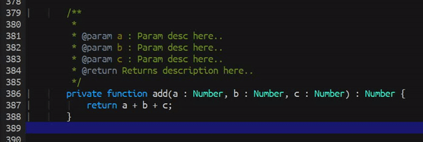

# Smart Move
> Smart enough to move cursor to the beginning of the line.

  

When the cursor is infront of the line in the useless space. 
Move the cursor to the front of the first word in the line.
