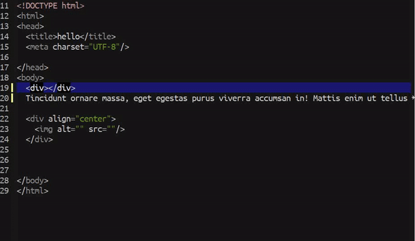

# Auto Truncate Lines
> Automatically enable/disable `truncate-lines-mode` depends 
on certain situation. (`web-mode` only)

  

Toggle `truncate-lines-mode` depends on the section of code 
your cursor currently on. If you are writing and not coding 
I think is good to have truncate lines disabled so is easier 
to see the full article.
