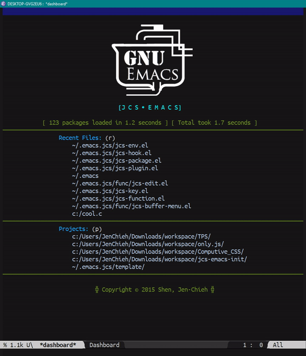

# Better Dashboard
> Implementation for improving experiences using dashboard.


## Realtime Updating Dashboard
The default `*dashboard*` wouldn't automatically update the 
item list when you do any changes until you manually called 
`dashboard-refresh-buffer` to refresh the `*dashboard*` buffer
yourself.


## Navigate with blank line

Originally, navigating with blank line will ignore the whole 
item sections (`Recent Files: (r)`, `Projects: (p)`, etc). 
I changed the behaviour so that it will navgiate to the item 
sections' title instead of just skip the whole section.

| Before                               | After                               |
|:-------------------------------------|:------------------------------------|
|||


## Navigate with Number Keys

You can navigate item sections by using the number keys 
starting from `0` to `9`.

<p align="center">
  
</p>


## Remove Items' item
You are able to delete the item directly from `*dashboard*` 
buffer by clicking `d`, `delete` or `backspace` keys. These 
are functions that you can use.

```
M-x jcs-dashboard-remove-current-item

M-x jcs-dashboard-remove-recent-files-item
M-x jcs-dashboard-remove-projects-item
```
