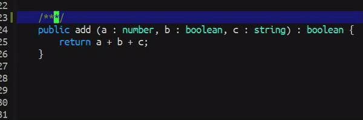

# Docstring Completion
> Some standard docstring completion implementations 
built-in to this configuration.

Here is the list of docstring demonstration to each 
supported mode.

## ActionScript

## C/C++

## C++ (Others)

## C#
### Normal Style

### Visual Studio Style

## Java

## JavaScript

## Lua

## PHP

## Python

## TypeScript

