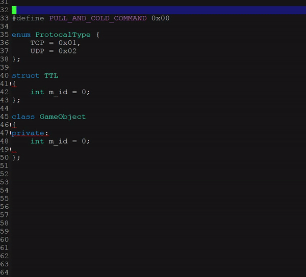
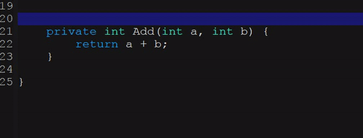
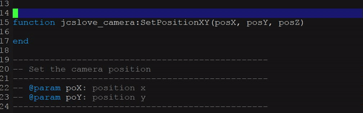
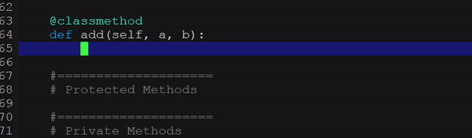

# Docstring Completion
> Some standard docstring completion implementations 
built-in to this configuration.

Here is the list of docstring demonstration to each 
supported mode.

## C/C++ Docstring

## C++ Docstring (Others)

## C# Docstring (Visual Studio)

## Java Docstring

## JavaScript Docstring

## Lua Docstring

## PHP Docstring

## Python Docstring

