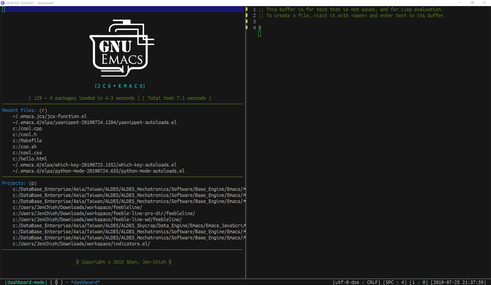

# Feebleline Design
> Personal displayed design for `feebleline`.

<p align="center">
  
</p>

This is my own design of displaying info in `minibuffer` using 
package `feebline`. The format is describe as below.

### On Left

```
buffer-read-only [major-mode] { project-name } - buffer-name
```

### On Right

```
[coding-system : line-ending] [spaces-or-tabs : tab-width] [line : column] [time]
```
