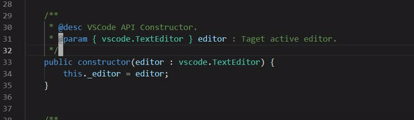

# VS Multiple Cursors
> VSCode like methods to `mark` and `unmark` cursor.

  | Emacs                        | VSCode                        |
  |:-----------------------------|:------------------------------|
  |||

